# Designing a 32-bit ALU for RISC-V ISA from scratch 
## Introduction
The objective of this project is to design a 32-bit ALU for RISC-V ISA using fast arithmetic techniques that I have learnt and applying resource sharing strategies. In other words, the ALU must be designed from scratch without using any pre-designed IP cores or inbuilt SystemVerilog operators. 

Therefore, the design is not intended to be implemented in FPGA because most of the fast arithmetic techniques used in this project is not optimal for LUT and DSP slices architecture in FPGA. Regardless, the design is still synthesized and implemented on an Artix-7 board, reaching maximum clock frequency of above 100MHz (where multiplication takes 3 cycles and division takes 24 cycles), total on chip power of 0.132W (0.041W dynamic power). The timing bottleneck is certainly the design of the divider unit. As expected, the resource usage is not optimal with around 3000 LUTs and 1000 slice registers and the multiplier and the divider units consume the majority of the resource. This is mainly because the mismatch between the fast arithmetic techniques in the design of the multiplier and the divider with the FPGA architecture.

Generally, the project is a great practice for academic purposes in terms of implementing advanced arithmetic techniques and resource sharing strategies into a modular ALU.
## Top-level ALU Architecture
### Top-level ALU Interface

  <figure>
    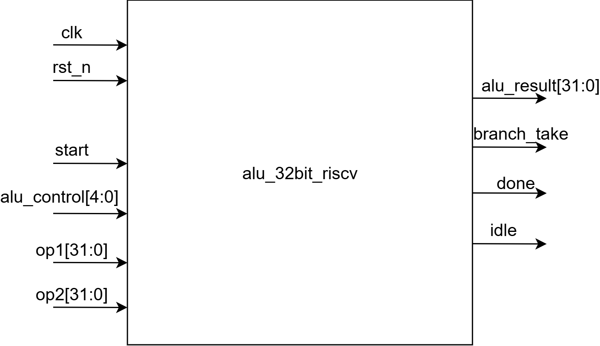
    <figcaption><i>Figure 1: Top-Level ALU Interface</i></figcaption>
  </figure>

The ALU interface receives a start signal from external controller to perform multi-cycle instruction, including multiplication and division. It should be noted that for multi-cycle operations, the done signal is only high for 1 clock cycle before going back to idle state.

For combinational instructions, such as addition, subtraction, both done and idle signals are always 1.
### Port Description Table

| Port Name | Direction | Width (Bits) | Type | Description |
| --- | --- | --- | --- | --- |
| **clk** | Input | 1 | Clock | Clock signal. |
| **rst_n** | Input | 1 | Reset | Active-low asynchronous reset. |
| **start** | Input | 1 | Control | Control signal to initiate the alu operation. |
| **alu_control** | Input | 5 | Control | Determine the specific alu operation. |
| **op1** | Input | 32 | Data | First operand. |
| **op2** | Input | 32 | Data | Second operand. |
| **alu_result** | Output | 32 | Data | Calculated result. |
| **branch_take** | Output | 1 | Status | High if a branch condition is true. |
| **done** | Output | 1 | Status | High if the alu result is stable and can be consumed |
| **idle** | Output | 1 | Status | High if the alu can accept new inputs |

### Instruction table and ALU operation

The 5-bit alu_control determines the instruction to execute, thus mapping to a specific ALU operation.

| Type | Instruction | ALU Operation | alu_control[4:0] |
| --- | --- | --- | --- |
| **Arithmetic** | add | 32-bit Addition | 00000 |
|  | sub | 32-bit Subtraction | 00001 |
|  | mul | Lower 32 bits of signed/unsigned multiplication | 10000 |
|  | mulh | Upper 32 bits of signed x signed | 10001 |
|  | mulhu | Upper 32 bits of unsigned x unsigned | 10010 |
|  | mulhsu | Upper 32 bits of signed x unsigned | 10011 |
|  | div | Signed division quotient | 10100 |
|  | divu | Unsigned division quotient | 10101 |
|  | rem | Signed division remainder | 10110 |
|  | remu | Unsigned division remainder | 10111 |
| **Logical** | and | Bitwise AND | 00101 |
|  | or | Bitwise OR | 00110 |
|  | xor | Bitwise XOR | 00111 |
| **Shift** | sll | Shift Left Logical | 00010 |
|  | srl | Shift Right Logical | 00011 |
|  | sra | Shift Right Arithmetic | 00100 |
| **Comparison & branch** | slt | Set Less Than (signed) | 01000 |
|  | sltu | Set Less Than (unsigned) | 01001 |
|  | beq | Branch if Equal | 01010 |
|  | bne | Branch if Not Equal | 01011 |
|  | blt | Branch if Less Than (signed) | 01100 |
|  | bge | Branch if Greater Than or Equal (signed) | 01101 |
|  | bltu | Branch if Less Than (unsigned) | 01110 |
|  | bgeu | Branch if Greater Than or Equal (unsigned) | 01111 |

### Block diagram
The figure below shows the block diagram structure of the top-level ALU. It consists of an Input Router which performs operand routing and operand isolation to reduce power, an Output Router that selects the correct ALU results from the execution unit.

  <figure>
    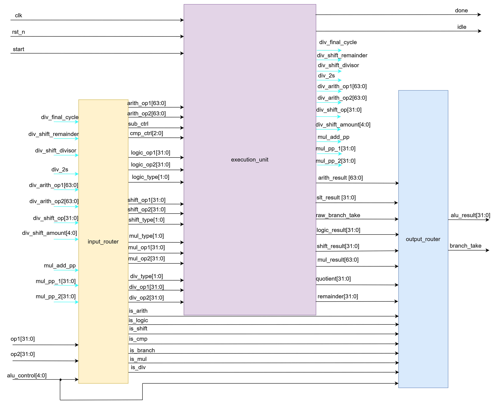
    <figcaption><i>Figure 2: ALU block diagram</i></figcaption>
  </figure>

## Input Router
Based on alu_control and status signals from the multiplier and divider, the input router routes the correct inputs for the active functional unit inside the execution unit, and performs operand isolation on other unactive units.

The status signals from the multiplier and divider are basically resource sharing requests. For example, when mul_add_pp is high, the multiplier asks the adder to sum the two partial products mul_pp_1 and mul_pp_2. Therefore in this case, the input router must route the two partial products into the correct input ports of the adder.

The input router must also output the type of instruction the execution unit is performing so that the output router can route the correct alu_result from the functional units.

  <figure>
    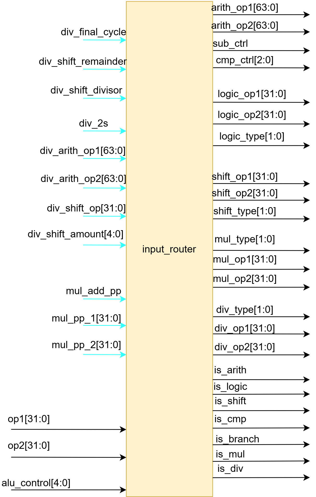
    <figcaption><i>Figure 3: Input Router</i></figcaption>
  </figure>

## Output Router
The Output Router routes the correct alu_result from the functional units based on the current instruction and flags from the Input Router.

  <figure>
    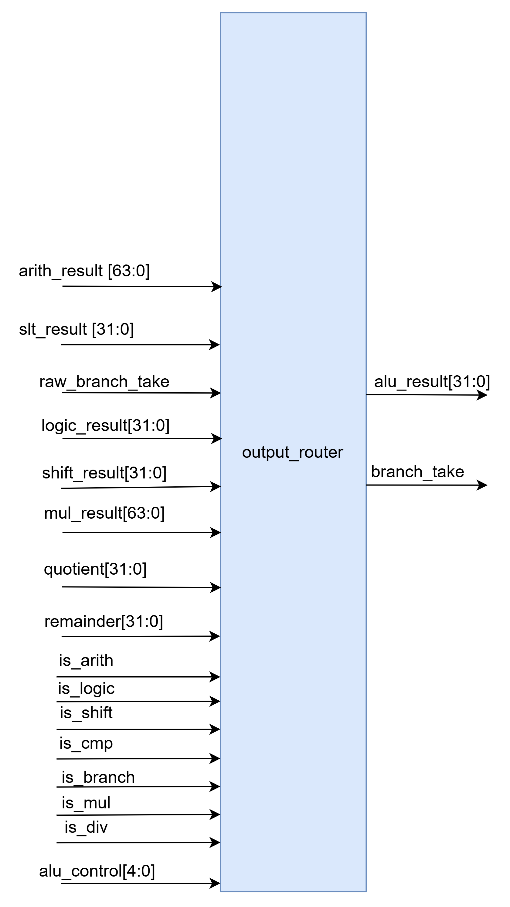
    <figcaption><i>Figure 4: Output Router</i></figcaption>
  </figure>

## Execution Unit Architecture
The execution units consists of 6 sub functional units: arith_unit, shift_unit, logic_unit, branch_unit, div_unit and mul_unit.

The div_unit and mul_unit share resource with other functional units but the wiring is not shown as the Input Router handles input wiring entirely.

  <figure>
    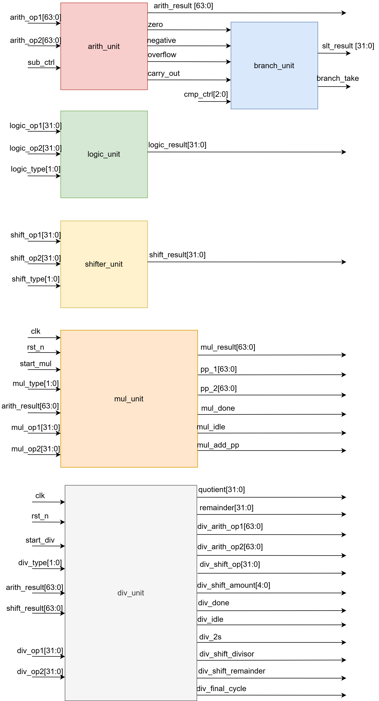
    <figcaption><i>Figure 5: Execution unit architecture</i></figcaption>
  </figure>

## The Arithmetic Unit
### Function and Implementation
The arith_unit is basically a 64-bit controlled adder/subtractor. Its main function is to execute addition and subtraction instruction. 
However, this is also a shared hardware resource that can handle four more distinct operations:
1. **Comparison & branching:** Performs subtraction to evaluate branch conditions and comparison instructions by evaluating the carry-out bit, zero, negative, overflow flags.
2. **Partial product accumulation:** Adds the final two 64-bit partial products generated by the Multiplier's Dadda Tree to produce the final product.
3. **Divider remainder reconstruction:** Adds rem_sum and rem_carry during the final stage of the non-restoring/SRT divider to reconstruct the actual remainder. If the sum of rem_sum and rem_carry overshoots, the arith_unit also fixes this by adding the normalized divisor back.
4. **Simultaneous 32-bit Two's Complement:** Compute the 2's complement of any two 32-bit numbers simultaneously during division sign processing.

To compute 2's complement of two 32-bit numbers $X$ and $Y$, the input operands of the arith_unit are as follows, with sub_ctrl set to 0 (perform addition):
$$op2[63:0] = \{Y[31:0], X[31:0]\}$$

$$op1[63:0] = \{31'\text{b0}, (|X[31:0]), 32'\text{b0}\}$$

  <figure>
    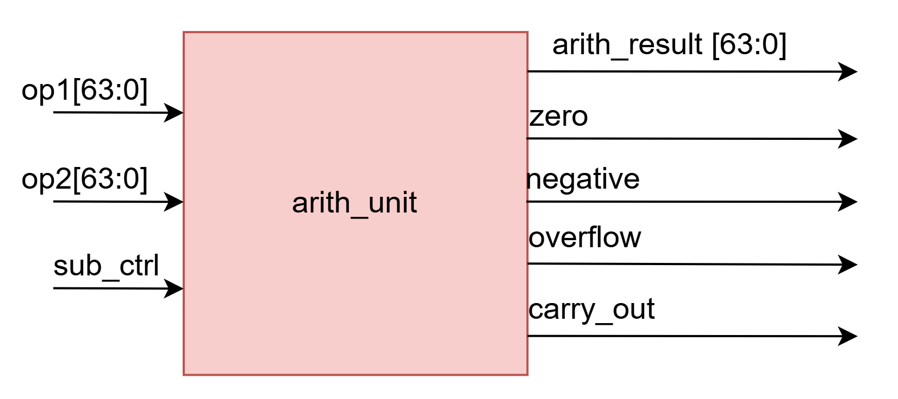
    <figcaption><i>Figure 6: Arithmetic Unit</i></figcaption>
  </figure>

The arith_unit is implemented using 1-bit CLA blocks. A total of 64 CLA blocks are used. 

  <figure>
    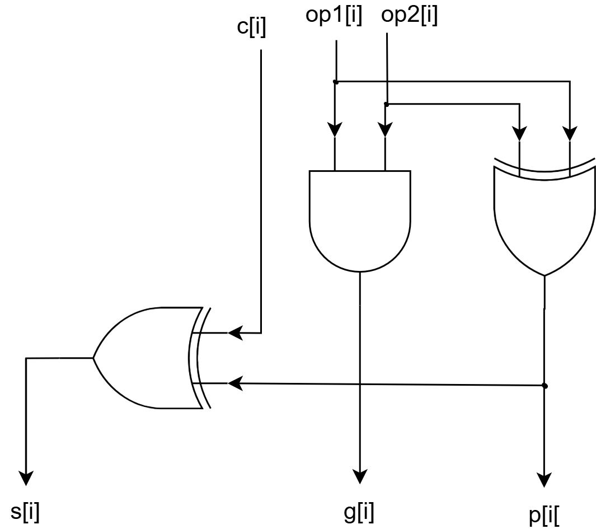
    <figcaption><i>Figure 7: 1-bit CLA block </i></figcaption>
  </figure>

To generate all carry bits, a Han-Carlson parallel prefix tree structure is applied. The figure below shows where to place the prefix operators in a 16-bit Han-Carlson tree for reference:

  <figure>
    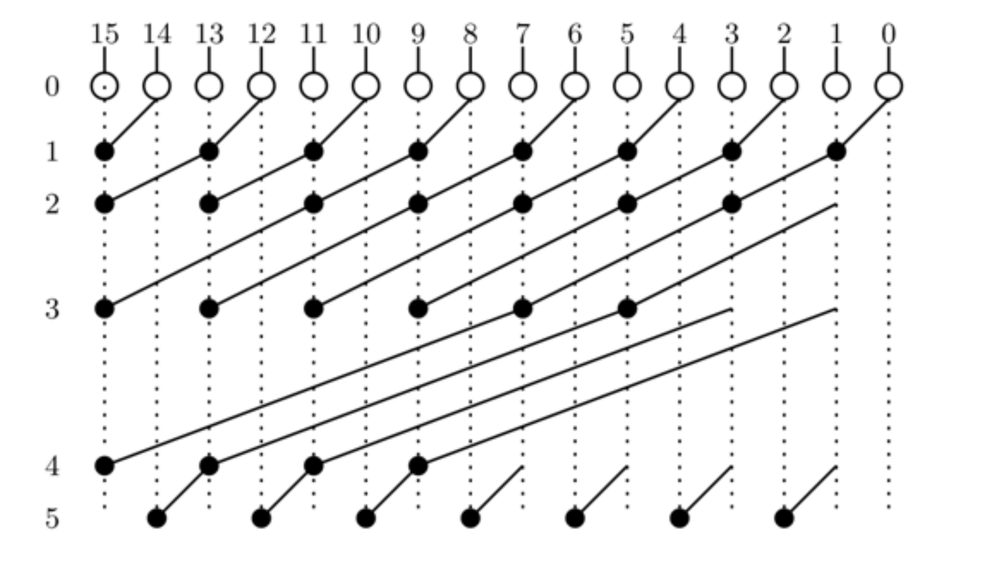
    <figcaption><i>Figure 8: 16-bit Han-Carlson tree </i></figcaption>
  </figure>

### Port Description Table

| Port Name | Direction | Width (Bits) | Type | Description |
| --- | --- | --- | --- | --- |
| **op1** | Input | 64 | Data | First input operand.  |
| **op2** | Input | 64 | Data | Second input operand. |
| **sub_ctrl** | Input | 1 | Control | Subtraction control flag. When high, the unit performs subtraction of two 64-bit numbers|
| **arith_result** | Output | 64 | Data | Computed result. |
| **zero** | Output | 1 | Status Flag | Asserted high if arith_result evaluates to zero. |
| **negative** | Output | 1 | Status Flag | Sign bit of the computed result. |
| **overflow** | Output | 1 | Status Flag | Asserted high if the operation causes a signed overflow. |
| **carry_out** | Output | 1 | Status Flag | carry-out bit from the most significant bit position. |

## The Branch Unit
The branch_unit is a combinational block that processes all the status flags from a subtraction operation executed by the arith_unit.

It has two primary functions:

1. **Branch Evaluation:** Determines whether the condition for a RISC-V conditional branch instruction evaluated to true and assert the raw_branch_take output accordingly.
2. **Comparison** Execute signed and unsigned comparison instructions.

  <figure>
    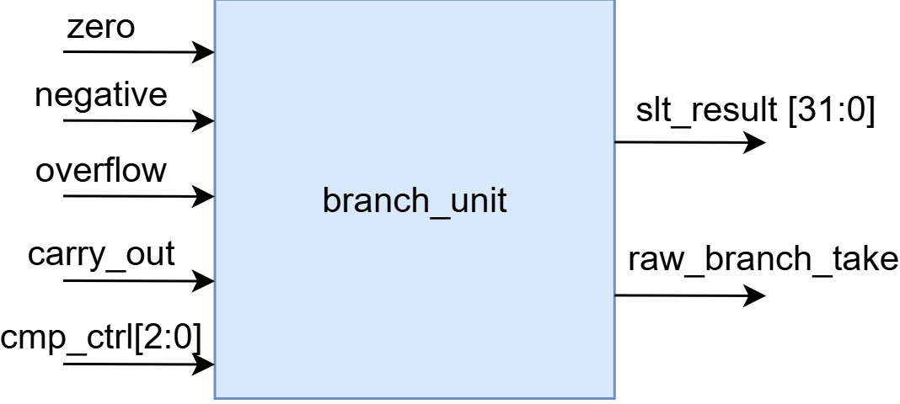
    <figcaption><i>Figure 9: Branch Unit</i></figcaption>
  </figure>

The table below shows how the 3-bit cmp_ctrl signal determines the branch, comparison instructions that the unit must execute.

| Instruction | cmp_ctrl[2:0] | Boolean Flag Condition for Output |
| --- | --- | --- |
| **slt** | 000 | $\text{negative} \oplus \text{overflow}$ |
| **sltu** | 001 | $\overline{\mathrm{carry\_out}}$ |
| **beq** | 010 | $\text{zero}$ |
| **bne** | 011 | $\overline{\text{zero}}$ |
| **blt** | 100 | $\text{negative} \oplus \text{overflow}$ |
| **bge** | 101 | $\overline{\text{negative} \oplus \text{overflow}}$ |
| **bltu** | 110 | $\overline{\mathrm{carry\_out}}$ |
| **bgeu** | 111 | $\mathrm{carry\_out}$ |

| Port Name | Direction | Width (Bits) | Type | Description |
| --- | --- | --- | --- | --- |
| **zero** | Input | 1 | Status Flag | Zero flag from arith_unit. |
| **negative** | Input | 1 | Status Flag | Sign status flag from arith_unit |
| **overflow** | Input | 1 | Status Flag | Signed overflow status flag from arith_unit. |
| **carry_out** | Input | 1 | Status Flag | Carry-out bit from arith_unit. |
| **cmp_ctrl** | Input | 3 | Control | Determine the branch, comparison instruction |
| **slt_result** | Output | 32 | Data | Equals 1 if the condition is satisfied during slt/sltu operations, otherwise 0. |
| **raw_branch_take** | Output | 1 | Control | Asserted when the branch condition evaluates to true. |

## The Logic Unit

The logic_unit is a combinational block that performs bitwise logical operations between two 32-bit operands. These operations include and, xor, and or instructions.

  <figure>
    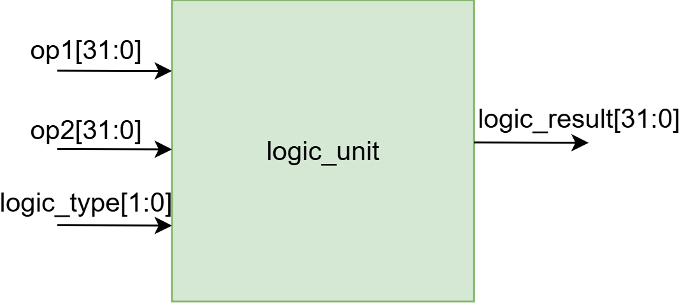
    <figcaption><i>Figure 10: Logic Unit</i></figcaption>
  </figure>

The table below shows how the 2-bit logic_type signal determines the logical operations that the unit must perform.

| Instruction | logic_type[1:0] | Executed Bitwise Operation |
| --- | --- | --- |
| **and** | 01 | Bitwise AND |
| **or** | 10 | Bitwise OR |
| **xor** | 11 | Bitwise XOR |

The table below shows the port description of the logic unit.

| Port Name | Direction | Width (Bits) | Type | Description |
| --- | --- | --- | --- | --- |
| **op1** | Input | 32 | Data | First 32-bit input operand. |
| **op2** | Input | 32 | Data | Second 32-bit input operand. |
| **logic_type** | Input | 2 | Control | Determine logic operation |
| **logic_result** | Output | 32 | Data | Computed result. |

## The Shifter Unit
The shifter_unit is a combinational block that executes shift instructions: Shift Left Logical, Shift Right Logical, and Shift Right Arithmetic. The first operand represents the 32-bit data to be shifted, while the 5 least significant bits of the second operand act as the shift amount.

The unit is a shared hardware resource as it also normalizes the divisor and denormalizes the remainder for the div_unit.

  <figure>
    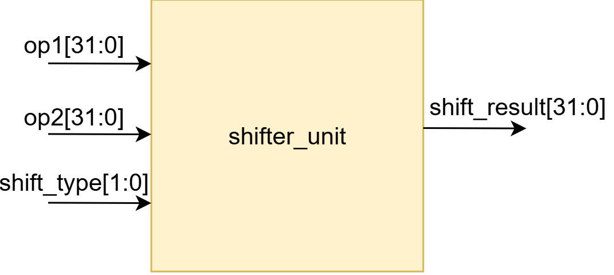
    <figcaption><i>Figure 11: Shifter Unit</i></figcaption>
  </figure>

The shifter_unit is designed as a 32-bit Barrel Shifter with Left/Right Unification. In other words, the unit itself is essentially a right Barrel Shifter that when a left shift by $n$ bits is requested, the hardware performs the operation through three stages:
1. The bit-order of the input operand is reversed.
2. The reversed result is passed through the standard right Barrel Shifter by $n$ bits.
3. The output of the right-shifter is reversed back to its original order.

The table below shows how the 2-bit shift_type signal determines the the shift operations that the unit must perform.

| Instruction | shift_type[1:0] | Shifter Direction | Padding Bit |
| --- | --- | --- | --- |
| **sll** | 10 | Left | 1'b0 (Logical) |
| **srl** | 11 | Right | 1'b0 (Logical) |
| **sra** | 00 | Right | op1[31] (Arithmetic Sign Bit) |

The table below shows the port description of the shifter unit.

| Port Name | Direction | Width (Bits) | Type | Description |
| --- | --- | --- | --- | --- |
| **op1** | Input | 32 | Data | 32-bit data operand to be shifted. |
| **op2** | Input | 32 | Data | Shift amount |
| **shift_type** | Input | 2 | Control | Determine shift operation |
| **shift_result** | Output | 32 | Data | Computed result. |

## The Multiplier Unit
### Function and Port description
The mul_unit is a multi-cycle functional unit that performs unsigned/signed multiplication. 

  <figure>
    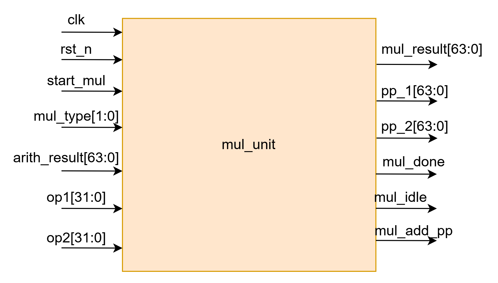
    <figcaption><i>Figure 12: Multiplier Unit</i></figcaption>
  </figure>

The table below shows how the 2-bit mul_type signal determines which multiplication instruction that the unit must perform.
| Instruction | mul_type[1:0] | Sign Consideration | Result |
| --- | --- | --- | --- |
| **mul** | 00 | Signed $\times$ Signed *(or Unsigned $\times$ Unsigned)* | Lower 32 bits: mul_result[31:0] |
| **mulh** | 01 | Signed $\times$ Signed | Upper 32 bits: mul_result[63:32] |
| **mulhu** | 10 | Unsigned $\times$ Unsigned | Upper 32 bits: mul_result[63:32] |
| **mulhsu** | 11 | Signed $\times$ Unsigned | Upper 32 bits: mul_result[63:32] |

The table below shows the port description for the mul_unit. It should be noted that the unit re-uses the arith_unit to calculate the sum of the two final partial products. This resource sharing strategy will be discussed in later sections.

| Port Name | Direction | Width (Bits) | Type | Description |
| --- | --- | --- | --- | --- |
| **clk** | Input | 1 | Clock | Clock signal |
| **rst_n** | Input | 1 | Reset | Active-low asynchronous reset. |
| **start_mul** | Input | 1 | Control | Asserted when the ALU is ready to perform multiplication |
| **mul_type** | Input | 2 | Control | Determine the multiplication operation |
| **arith_result** | Input | 64 | Data | The sum of the two partial products from arith_unit |
| **op1** | Input | 32 | Data | 32-bit multiplier operand. |
| **op2** | Input | 32 | Data | 32-bit multiplicand operand. |
| **mul_result** | Output | 64 | Data | The multiplication result. |
| **pp_1** | Output | 64 | Data |  Partial product from the Dadda Tree matrix. |
| **pp_2** | Output | 64 | Data | Partial product from the Dadda Tree matrix. |
| **mul_done** | Output | 1 | Status | Asserted high for one clock cycle to signal completion of the multiplication. |
| **mul_idle** | Output | 1 | Status | Status flag indicating that the multiplier is ready to accept new inputs. |
| **mul_add_pp** | Output | 1 | Control | Resource request signal sent to the Input Router to route the two partial products into arith_unit operand ports. |

### Design and Implementation
The mul_unit is designed using Booth's radix 4 partial product generation. For the unit to support both 32-bit signed and unsigned multiplication, the unit must treat operands as signed 33-bit numbers as the Booth's radix 4 inherently works with signed numbers. If the instruction treats an operand as unsigned, the MSB (33th bit) will be zero extended, otherwise, the MSB will be sign-extended. This ensures that 33-bit multiplication is always signed regardless of the original instruction.

A total of 18 partial products are generated and are then rearranged using Baugh-Wooley structure. 

A rearrangement for a 6-bit multiplier is shown in the figure below for reference. Note that the black circles indicate the inversion of bits if the sign bit of the same row is 1, otherwise, original bits of the partial product matrix. 

  <figure>
    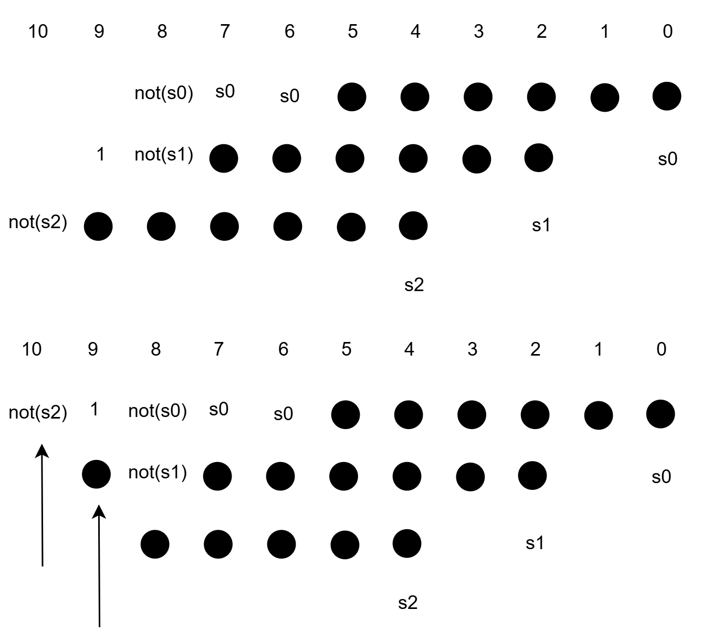
    <figcaption><i>Figure 13: Partial product structure for 6-bit multiplier</i></figcaption>
  </figure>

To accumulate this partial product matrix with 18 rows, a Dadda tree structure is used. The Dadda tree reduces the height of the partial product matrix in a specific order: 18 &rarr; 13 &rarr; 9 &rarr; 6 &rarr; 4 &rarr; 3 &rarr; 2 by placing half adders and full adders in specific bit positions.

The Dadda tree requires 6 stages to reduce 18 rows into two final partial products. The multiplication result is actually the sum of these two partial products. This is done by re-using the arith_unit to perform addition on two 64-bit numbers. 

Due to the long combinational path of partial product generation and accumulation, the mul_unit splits this combinational path into 4 stages. This means that for every multiplication instruction, the unit takes 3 cycles to finish calculation and reaches the DONE state.

The ASMD chart below shows the execution step of the unit.

  <figure>
    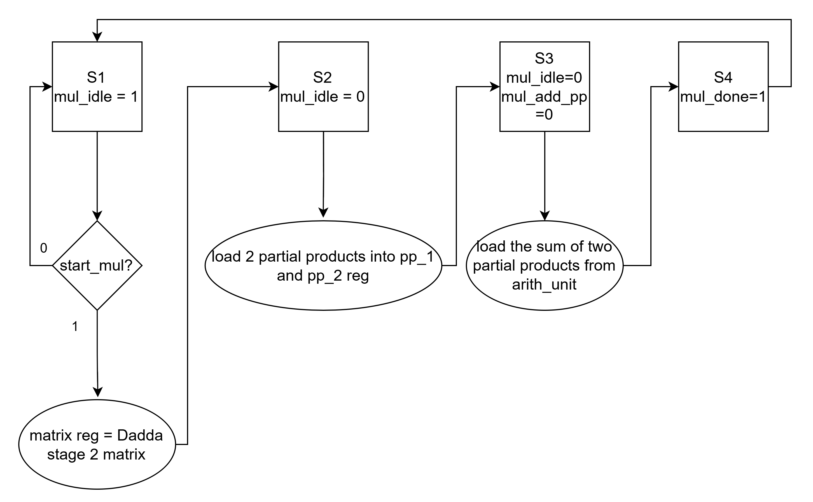
    <figcaption><i>Figure 14: ASMD chart for the execution of the multiplier</i></figcaption>
  </figure>

Because the state transition is primarily unconditional, the unit is implemented using a shift register architecture instead of a heavy FSM controller.

## The Divider Unit
### Function and Port description
The div_unit is a multi-cycle functional unit that performs unsigned/signed division. 

  <figure>
    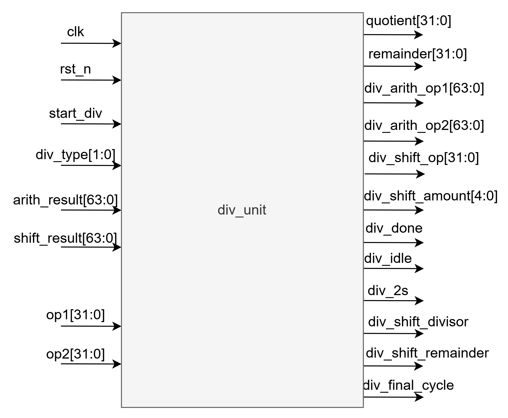
    <figcaption><i>Figure 15: Divider Unit</i></figcaption>
  </figure>

The table below shows how the 2-bit div_type signal determines which division instruction that the unit must perform.

| Instruction | div_type[1:0] | Operand Interpretation | Selected Output Component |
| --- | --- | --- | --- |
| **div** | 00 | Signed | Quotient |
| **divu** | 01 | Unsigned | Quotient |
| **rem** | 10 | Signed | Remainder |
| **remu** | 11 | Unsigned | Remainder |

The table below shows the port description for the div_unit. It should be noted that the unit re-uses the arith_unit and shift_unit to perform certain operations. This resource sharing strategy will be discussed in later sections.

| Port Name | Direction | Width (Bits) | Type | Description |
| --- | --- | --- | --- | --- |
| **clk** | Input | 1 | Clock | Clock signal. |
| **rst_n** | Input | 1 | Reset | Active-low asynchronous reset. |
| **start_div** | Input | 1 | Control | Asserted when the ALU is ready to perform division |
| **div_type** | Input | 2 | Control | Determine the division instruction |
| **arith_result** | Input | 64 | Data | Results from shared hardware resource arith_unit |
| **shift_result** | Input | 64 | Data | Results from shared hardware resource shifter_unit |
| **op1** | Input | 32 | Data | Dividend |
| **op2** | Input | 32 | Data | Divisor |
| **quotient** | Output | 32 | Data | Quotient result |
| **remainder** | Output | 32 | Data | Remainder result |
| **div_arith_op1** | Output | 64 | Data | First input operand for arith_unit |
| **div_arith_op2** | Output | 64 | Data | Second input operand for arith_unit |
| **div_shift_op** | Output | 32 | Data | Input operand to be shifted for shifter_unit |
| **div_shift_amount** | Output | 5 | Data | Shift amount for shifter_unit |
| **div_done** | Output | 1 | Status | Asserted high for one clock cycle to signal completion of the division. |
| **div_idle** | Output | 1 | Status | Status flag indicating that the divider is ready to accept new inputs. |
| **div_2s** | Output | 1 | Control | Request signal for arith_unit to perform dual 32-bit two's complement. |
| **div_shift_divisor** | Output | 1 | Control | Request signal for shifter_unit to perform normalizing the divisor. |
| **div_shift_remainder** | Output | 1 | Control | Request signal for shifter_unit to perform denormalizing the remainder. |
| **div_final_cycle** | Output | 1 | Control | Request signal for arith_unit to add rem_sum and rem_carry |

### Design and Implementation
The div_unit is designed as a Radix-4 SRT divider with on-the-fly conversion and a look-up table to estimate the quotient bit.

The ASMD chart below shows the execution step of the unit:

  <figure>
    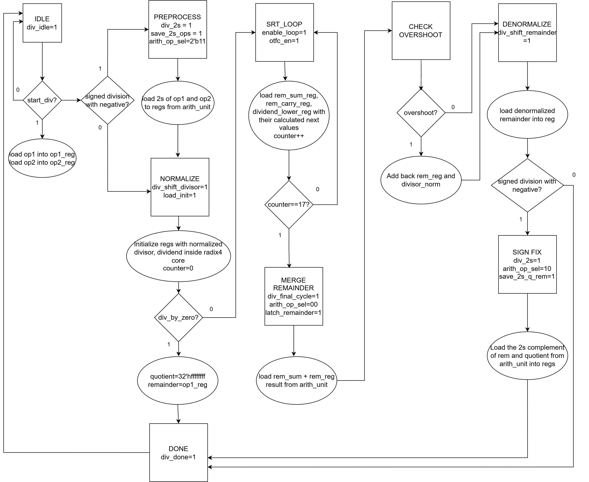
    <figcaption><i>Figure 16: ASMD chart for the execution of the divider</i></figcaption>
  </figure>

During the IDLE state, the controller waits for the start_div signal to go high then the datapath latches the dividend and the divisor into op1_reg and op2_reg. If the instruction is signed division with negative operands, next state will evaluate to PREPROCESS instead of straight to NORMALIZE state.

During the PREPROCESS state, the unit sends request signal and the registers holding the dividend and the divisor values to the arith_unit to perform two's complement. Then the datapath will latch the results from the arith_unit back to internal registers. The next state will unconditionally evaluate to NORMALIZE state.

During the NORMALIZE state, the divisor is routed to the shifter_unit to be left-shifted until its most significant bit is a '1' (normalization). The internal Radix-4 core registers are initialized with this normalized divisor and the normalized dividend. The loop counter is also set to 0. If the divisor is zero, the quotient is forced to 32'hffffffff, the remainder is set to the original dividend value and next state will evaluate to DONE state, otherwise, it will be SRT_LOOP state.

During the SRT_LOOP state, the next partial remainder is calculated in carry-save format with rem_sum and rem_carry registers. Based on the estimated quotient bit from the LUT, on-the-fly conversion logic will update the quotient registers q and qm accordingly. The counter is then incremented until it reaches 17, next state will evaluate to MERGE_REMAINDER state.

During the MERGE_REMAINDER state, rem_sum and rem_carry registers are routed to the arith_unit to be added together, and the result is latched into rem register. The next state will unconditionally be CHECK_OVERSHOOT state.

During the CHECK_OVERSHOOT state, if the remainder is negative, the normalized divisor (divisor_norm) is added back to the remainder to restore the correct positive value, then next state transitions to DENORMALIZE. Otherwise, next state will evaluate to DENORMALIZE state.

During the DENORMALIZE state, The corrected remainder is routed to the shifter_unit to be right-shifted by the same amount the divisor was originally left-shifted. If the original instruction is signed division with negative quotient result, next state will be SIGN_FIX state, otherwise DONE state.

During the SIGN_FIX state, the unit sends request signals to the arith_unit to perform a two's complement operation on the final quotient and/or remainder. Next state unconditionally jump to DONE state where div_done status signal will go high.

Using the ASMD chart, the unit can be designed in datapath and controller structure as follows:

  <figure>
    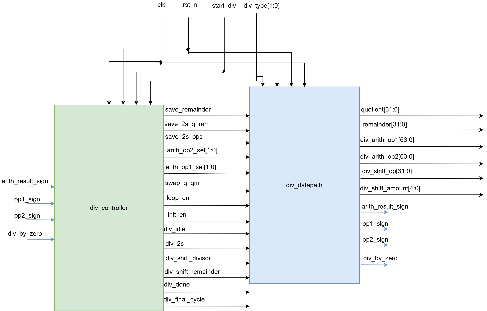
    <figcaption><i>Figure 17: Datapath and controller structure for the divider</i></figcaption>
  </figure>

The table below shows the description for status signals from the datapath to the controller.
| Port Name | Width | Description |
| --- | --- | --- |
| **arith_result_sign** | 1 | The sign bit (MSB) of the external arith_result bus. Used primarily during the CHECK OVERSHOOT state to detect if the final partial remainder is negative.
| **op1_sign** | 1 | The original sign bit of the dividend (op1). Used to determine if the PREPROCESS 2's complement is needed, and to calculate the final sign of the remainder. |
| **op2_sign** | 1 | The original sign bit of the divisor (op2). XOR'd with op1_sign in the controller to determine if the SIGN FIX state is required for the final quotient. |
| **div_by_zero** | 1 | Evaluates to high if the input divisor is zero. Checked during the NORMALIZE state to abort the loop and jump directly to DONE. |

The table below shows the description for control signals from the the controller to the datapath.
| Port Name | Width | Description |
| --- | --- | --- |
| **save_remainder** | 1 | Latches the resolved remainder (from the MERGE REMAINDER or CHECK OVERSHOOT states) into the final remainder output register. |
| **save_2s_q_rem** | 1 | Asserted during the SIGN FIX state. Commands the datapath to overwrite the quotient and/or remainder registers with their 2's complemented values returning from the arith_unit. |
| **save_2s_ops** | 1 | Asserted during the PREPROCESS state. Commands the datapath to latch the absolute values of the operands returning from the arith_unit. |
| **arith_op1_sel** | 2 | Internal multiplexer select for div_arith_op1. |
| **arith_op2_sel** | 2 | Internal multiplexer select for div_arith_op2. |
| **swap_q_qm** | 1 | On-The-Fly Conversion control bit. Dictates whether the primary Quotient register (Q) and Quotient-Minus-One register (QM) should shift in standard values or swap based on the calculated SRT quotient bit. |
| **loop_en** | 1 | Asserted during the SRT_LOOP state. Enables the core Radix-4 shifting and carry-save-adder updates for each iteration. |
| **init_en** | 1 | Asserted in NORMALIZE to latch the normalized divisor and dividend, and prepare the partial remainder registers for the first iteration. |

